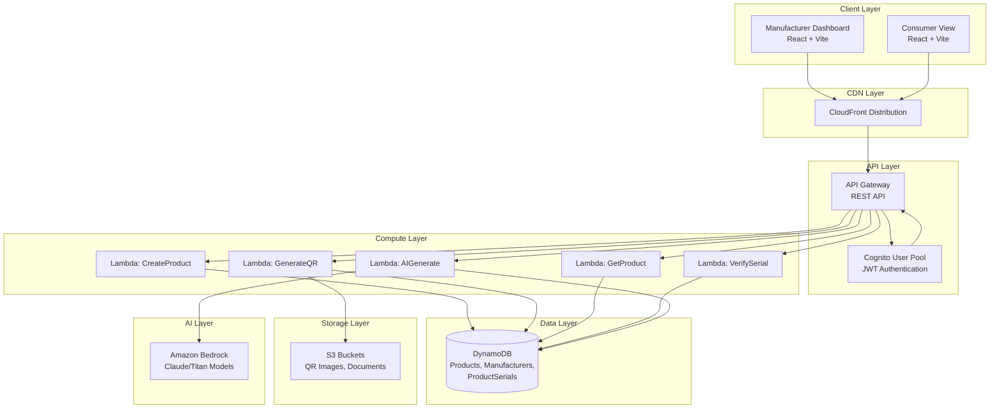
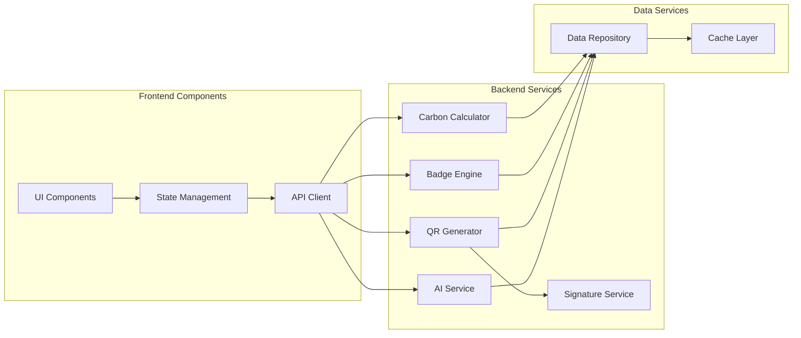

# Design Document: Green Passport AWS Native Serverless Platform

## Overview

The Green Passport (GP) AWS Native Serverless Platform is a Digital Product Passport (DPP) system built entirely on AWS serverless services. The platform enables manufacturers to create comprehensive product profiles with carbon footprint tracking, generate batch QR codes with digital signatures, and provide consumers with a verification interface to access product sustainability information.

### System Goals

- Provide manufacturers with a streamlined interface to manage product lifecycle data and sustainability metrics
- Enable automated carbon footprint calculation and sustainability badge assignment
- Generate secure, verifiable QR codes for product authentication
- Offer consumers a transparent view of product environmental impact
- Leverage AWS serverless architecture for scalability, cost-efficiency, and minimal operational overhead
- Integrate AI capabilities for content generation and sustainability insights

### Key Features

1. **Manufacturer Dashboard**: Web application for product management with multi-step structured lifecycle data entry and real-time emission calculations
2. **Consumer Verification View**: Public interface for QR scanning and product information display
3. **Carbon Calculator**: Automated CO2 emission computation from detailed lifecycle data with section-by-section breakdown
4. **Badge Engine**: Threshold-based sustainability badge assignment
5. **QR Generator**: Batch QR code creation with digital signatures
6. **AI Integration**: Amazon Bedrock for product descriptions and sustainability insights
7. **Secure Authentication**: Amazon Cognito for manufacturer identity management
8. **Structured Lifecycle Form**: Six-section data entry with progress tracking, real-time validation, and emission preview

## Architecture

### High-Level Architecture

The system follows a serverless architecture pattern with clear separation between frontend, API layer, business logic, and data storage.



### Component Architecture



### AWS Service Integration

| Service | Purpose | Configuration |
|---------|---------|---------------|
| CloudFront | Global CDN for frontend hosting | HTTPS enabled, cache TTL optimized |
| API Gateway | REST API routing and request validation | CORS enabled, JWT authorizer |
| Lambda | Serverless compute for business logic | Node.js 20.x runtime, 512MB-1GB memory |
| DynamoDB | NoSQL database for products and serials | On-demand billing, GSI indexes |
| S3 | Object storage for QR images and documents | Private buckets, signed URLs |
| Cognito | User authentication and authorization | User pool with JWT tokens |
| Bedrock | Generative AI for content and insights | Claude 3 Sonnet model |
| CloudWatch | Logging and monitoring | Structured logs, error tracking |
| IAM | Access control and permissions | Least privilege roles per function |

## Components and Interfaces

### 1. Authentication Service

**Responsibility**: Manage manufacturer authentication and authorization using Amazon Cognito.

**Interface**:
```typescript
interface AuthenticationService {
  login(email: string, password: string): Promise<AuthResult>
  validateToken(token: string): Promise<TokenValidation>
  refreshToken(refreshToken: string): Promise<AuthResult>
  logout(token: string): Promise<void>
}

interface AuthResult {
  accessToken: string
  refreshToken: string
  expiresIn: number
  manufacturerId: string
}

interface TokenValidation {
  valid: boolean
  manufacturerId?: string
  error?: string
}
```

**Implementation Details**:
- Cognito User Pool with email/password authentication
- JWT tokens with 1-hour expiration
- API Gateway JWT authorizer validates tokens on all protected endpoints
- Manufacturer role stored in Cognito user attributes

### 2. Carbon Calculator

**Responsibility**: Compute total CO2 emissions from product lifecycle data with real-time calculation support.

**Interface**:
```typescript
interface CarbonCalculator {
  calculateFootprint(lifecycleData: LifecycleData): CarbonFootprintResult
  calculateMaterialEmission(material: Material_Row): number
  calculateManufacturingEmission(data: Manufacturing_Data): number
  calculatePackagingEmission(data: Packaging_Data): number
  calculateTransportEmission(data: Transport_Data): number
  calculateUsageEmission(data: Usage_Data): number
  calculateDisposalEmission(data: EndOfLife_Data): number
}

interface CarbonFootprintResult {
  totalCO2: number
  breakdown: {
    materials: number
    manufacturing: number
    packaging: number
    transport: number
    usage: number
    disposal: number
  }
}

interface LifecycleData {
  materials: Material_Row[]
  manufacturing: Manufacturing_Data
  packaging: Packaging_Data
  transport: Transport_Data
  usage: Usage_Data
  endOfLife: EndOfLife_Data
}

interface Material_Row {
  name: string
  percentage: number              // 0-100
  weight: number                  // in kg
  emissionFactor: number          // kg CO2 per kg material
  countryOfOrigin: string
  recycled: boolean               // true = recycled, false = virgin
  certification?: string          // optional certification
  calculatedEmission: number      // computed: weight × emissionFactor
}

interface Manufacturing_Data {
  factoryLocation: string
  energyConsumption: number       // kWh per piece
  energyEmissionFactor: number    // kg CO2 per kWh
  dyeingMethod: string
  waterConsumption: number        // litres
  wasteGenerated: number          // kg
  calculatedEmission: number      // computed: energyConsumption × energyEmissionFactor
}

interface Packaging_Data {
  materialType: string
  weight: number                  // kg
  emissionFactor: number          // kg CO2 per kg
  recyclable: boolean
  calculatedEmission: number      // computed: weight × emissionFactor
}

interface Transport_Data {
  mode: 'Road' | 'Air' | 'Ship'
  distance: number                // km
  fuelType: string
  emissionFactorPerKm: number     // kg CO2 per km
  calculatedEmission: number      // computed: distance × emissionFactorPerKm
}

interface Usage_Data {
  avgWashCycles: number
  washTemperature: number         // degrees Celsius
  dryerUse: boolean
  calculatedEmission: number      // computed based on wash cycles, temp, dryer
}

interface EndOfLife_Data {
  recyclable: boolean
  biodegradable: boolean
  takebackProgram: boolean
  disposalEmission: number        // kg CO2
}
```

**Calculation Formula**:
```
Total CO2 = Sum(all Material_Emissions) + 
            Manufacturing_Emission + 
            Packaging_Emission + 
            Transport_Emission + 
            Usage_Emission + 
            Disposal_Emission

Where:
  Material_Emission = material.weight × material.emissionFactor
  Manufacturing_Emission = energyConsumption × energyEmissionFactor
  Packaging_Emission = packaging.weight × packaging.emissionFactor
  Transport_Emission = distance × emissionFactorPerKm
  Usage_Emission = f(avgWashCycles, washTemperature, dryerUse)
  Disposal_Emission = endOfLife.disposalEmission (user-provided)
```

**Real-Time Calculation Logic**:
- Each section calculates its emission immediately when data is entered
- Frontend calls calculation methods as form fields change
- Emission_Preview sidebar updates in real-time
- Running total accumulates as sections are completed

**Performance**: 
- Individual section calculations must complete within 50ms
- Total footprint calculation must complete within 500ms

### 3. Badge Engine

**Responsibility**: Assign sustainability badges based on carbon footprint thresholds.

**Interface**:
```typescript
interface BadgeEngine {
  assignBadge(carbonFootprint: number): Badge
}

interface Badge {
  name: string
  color: string
  threshold: string
}
```

**Badge Assignment Rules**:
- Carbon < 4 kg: "Environment Friendly" (green)
- Carbon 4-7 kg: "Moderate Impact" (yellow)
- Carbon > 7 kg: "High Impact" (red)

**Performance**: Badge assignment must complete within 100ms.

### 4. QR Generator

**Responsibility**: Generate batch QR codes with unique serial IDs and digital signatures.

**Interface**:
```typescript
interface QRGenerator {
  generateBatch(productId: string, count: number): Promise<QRBatchResult>
}

interface QRBatchResult {
  serialIds: string[]
  qrImages: Buffer[]
  zipUrl: string
  expiresAt: Date
}
```

**Serial ID Format**: `{productId}-{paddedIndex}`
- Example: `PROD001-0001`, `PROD001-0002`, etc.

**Digital Signature**:
```typescript
interface SignatureService {
  generateSignature(data: SignatureData): string
}

interface SignatureData {
  productId: string
  serialId: string
  manufacturerId: string
  carbonFootprint: number
}
```

Signature = SHA256(productId + serialId + manufacturerId + carbonFootprint)

**Performance**: 
- Batch generation for N ≤ 1000 must complete within 5 seconds
- N > 1000 returns validation error

**Storage**:
- QR images stored in S3 with private access
- ZIP archive created and accessible via signed URL (1-hour expiration)

### 5. AI Service

**Responsibility**: Generate product descriptions and sustainability insights using Amazon Bedrock.

**Interface**:
```typescript
interface AIService {
  generateDescription(productData: ProductData): Promise<string>
  generateInsights(lifecycleData: LifecycleData, carbonFootprint: number): Promise<string>
}

interface ProductData {
  name: string
  category: string
  materials: string[]
  manufacturingProcess: string
}
```

**Implementation Details**:
- Uses Amazon Bedrock with Claude 3 Sonnet model
- Description generation: 3-second timeout
- Insights generation: Analyzes carbon footprint and lifecycle data
- RAG workflow for compliance narratives (optional enhancement)

### 6. Product Repository

**Responsibility**: Manage CRUD operations for products, manufacturers, and serials.

**Interface**:
```typescript
interface ProductRepository {
  createProduct(product: Product): Promise<Product>
  getProduct(productId: string): Promise<Product | null>
  updateProduct(productId: string, updates: Partial<Product>): Promise<Product>
  listProductsByManufacturer(manufacturerId: string): Promise<Product[]>
  
  createSerial(serial: ProductSerial): Promise<ProductSerial>
  getSerial(serialId: string): Promise<ProductSerial | null>
  listSerialsByProduct(productId: string): Promise<ProductSerial[]>
  
  getManufacturer(manufacturerId: string): Promise<Manufacturer | null>
  updateManufacturer(manufacturerId: string, updates: Partial<Manufacturer>): Promise<Manufacturer>
}
```

### 7. Verification Service

**Responsibility**: Verify QR code authenticity by validating digital signatures.

**Interface**:
```typescript
interface VerificationService {
  verifySerial(serialId: string): Promise<VerificationResult>
}

interface VerificationResult {
  verified: boolean
  product?: Product
  manufacturer?: Manufacturer
  serial?: ProductSerial
  error?: string
}
```

**Verification Process**:
1. Retrieve serial record from database
2. Retrieve associated product and manufacturer data
3. Recompute digital signature from current data
4. Compare stored signature with computed signature
5. Return verification status (must complete within 200ms)

### 8. Frontend Components

#### Manufacturer Dashboard

**Key Components**:
- `DashboardLayout`: Main layout with sidebar navigation
- `Lifecycle_Form`: Multi-step form for structured lifecycle data entry
- `ProgressIndicator`: Horizontal step indicator showing current section
- `Emission_Preview`: Real-time sidebar showing emission calculations
- `MaterialTable`: Dynamic multi-row table for material entries
- `ProductsList`: Table view of all products with filtering
- `QRManagement`: Interface for batch QR generation
- `AnalyticsDashboard`: Charts and metrics overview
- `SettingsPanel`: Profile and configuration management
- `ConfettiPopup`: Animated confirmation with sustainability badge

**Lifecycle_Form Component Specification**:

```typescript
interface Lifecycle_FormProps {
  onSubmit: (data: LifecycleData) => Promise<void>
  onSaveDraft: (data: Partial<LifecycleData>) => Promise<void>
  initialData?: Partial<LifecycleData>
}

interface Lifecycle_FormState {
  currentStep: number  // 0-5 (6 sections)
  formData: Partial<LifecycleData>
  validationErrors: Record<string, string>
  isCalculating: boolean
}
```

**Form Sections**:
1. **Raw Materials** (Step 0)
   - Dynamic MaterialTable with add/remove rows
   - Fields per row: name (dropdown + custom), percentage, weight, emissionFactor, countryOfOrigin, recycled (toggle), certification (optional)
   - Real-time calculation of materialEmission per row
   - Validation: total percentages must sum to 100%

2. **Manufacturing** (Step 1)
   - Fields: factoryLocation, energyConsumption, energyEmissionFactor, dyeingMethod (dropdown), waterConsumption, wasteGenerated
   - Real-time calculation: manufacturingEmission = energyConsumption × energyEmissionFactor

3. **Packaging** (Step 2)
   - Fields: materialType (dropdown), weight, emissionFactor, recyclable (toggle)
   - Real-time calculation: packagingEmission = weight × emissionFactor

4. **Transport** (Step 3)
   - Fields: mode (dropdown: Road/Air/Ship), distance, fuelType (dropdown), emissionFactorPerKm
   - Real-time calculation: transportEmission = distance × emissionFactorPerKm

5. **Usage Phase** (Step 4)
   - Fields: avgWashCycles, washTemperature, dryerUse (toggle)
   - Real-time calculation: usageEmission based on formula

6. **End of Life** (Step 5)
   - Fields: recyclable (toggle), biodegradable (toggle), takebackProgram (toggle), disposalEmission
   - Display disposalEmission value

**ProgressIndicator Component**:
```typescript
interface ProgressIndicatorProps {
  steps: string[]  // ['Raw Materials', 'Manufacturing', 'Packaging', 'Transport', 'Usage Phase', 'End of Life']
  currentStep: number
  completedSteps: number[]
}
```
- Horizontal layout with step numbers and labels
- Active step highlighted in blue
- Completed steps shown with checkmark
- Clickable to navigate between completed steps

**Emission_Preview Component**:
```typescript
interface Emission_PreviewProps {
  breakdown: {
    materials: number
    manufacturing: number
    packaging: number
    transport: number
    usage: number
    disposal: number
  }
  totalCO2: number
  badge?: Badge
}
```
- Fixed sidebar on right side of form
- Shows emission breakdown by category
- Updates in real-time as form fields change
- Displays running total
- Shows assigned badge when calculation complete

**MaterialTable Component**:
```typescript
interface MaterialTableProps {
  materials: Material_Row[]
  onAdd: () => void
  onRemove: (index: number) => void
  onChange: (index: number, field: keyof Material_Row, value: any) => void
  onCalculate: (index: number) => void
}
```
- Table with columns: Name, %, Weight (kg), Emission Factor, Origin, Type (Recycled/Virgin), Certification, Calculated Emission, Actions
- "Add Material" button below table
- Delete icon per row
- Dropdown for common materials with custom entry option
- Real-time emission calculation per row

**Form Navigation**:
- "Previous" button (disabled on first step)
- "Next" button (validates current section before proceeding)
- "Save as Draft" button (available on all steps)
- "Submit" button (only on final step, validates all sections)

**Validation Rules**:
- Raw Materials: at least 1 material, percentages sum to 100%, all required fields filled
- Manufacturing: all numeric fields > 0, location non-empty
- Packaging: weight > 0, emissionFactor > 0
- Transport: distance > 0, emissionFactorPerKm > 0
- Usage Phase: avgWashCycles > 0, washTemperature > 0
- End of Life: disposalEmission >= 0

**State Management**: React Context API or Zustand for global state

**Routing**:
- `/dashboard` - Overview and analytics
- `/create-dpp` - Product creation form with Lifecycle_Form
- `/products` - Products list
- `/qr-management` - QR generation interface
- `/auditor` - Audit logs and history
- `/settings` - User settings

#### Consumer View

**Key Components**:
- `QRScanner`: Camera-based QR scanning interface
- `SerialInput`: Manual serial number entry
- `ProductDisplay`: Comprehensive product information view
- `LifecycleChart`: Bar chart for emission breakdown
- `MaterialChart`: Pie chart for material composition
- `SustainabilityGauge`: Gauge meter for sustainability score
- `VerificationBadge`: Visual indicator of signature verification

**Routing**:
- `/` - Landing page with scanner
- `/product/:serialId` - Product details view

## Data Models

### DynamoDB Tables

#### 1. Manufacturers Table

**Primary Key**: `manufacturerId` (String)

**Attributes**:
```typescript
interface Manufacturer {
  manufacturerId: string      // PK
  name: string
  location: string
  certifications: string[]
  contactEmail: string
  createdAt: string          // ISO 8601 timestamp
  updatedAt: string          // ISO 8601 timestamp
}
```

**Access Patterns**:
- Get manufacturer by ID
- Update manufacturer profile

#### 2. Products Table

**Primary Key**: `productId` (String)
**Global Secondary Index**: `manufacturerId-index` (GSI)

**Attributes**:
```typescript
interface Product {
  productId: string           // PK
  manufacturerId: string      // GSI partition key
  name: string
  description: string
  category: string
  
  // Structured Lifecycle Data
  lifecycleData: {
    materials: Material_Row[]
    manufacturing: Manufacturing_Data
    packaging: Packaging_Data
    transport: Transport_Data
    usage: Usage_Data
    endOfLife: EndOfLife_Data
  }
  
  // Carbon Metrics
  carbonFootprint: number     // Total CO2 in kg
  carbonBreakdown: {
    materials: number
    manufacturing: number
    packaging: number
    transport: number
    usage: number
    disposal: number
  }
  sustainabilityScore: number // 0-100 scale
  badge: {
    name: string
    color: string
    threshold: string
  }
  
  // Metadata
  createdAt: string
  updatedAt: string
}

interface Material_Row {
  name: string
  percentage: number              // 0-100
  weight: number                  // kg
  emissionFactor: number          // kg CO2 per kg material
  countryOfOrigin: string
  recycled: boolean               // true = recycled, false = virgin
  certification?: string          // optional
  calculatedEmission: number      // weight × emissionFactor
}

interface Manufacturing_Data {
  factoryLocation: string
  energyConsumption: number       // kWh per piece
  energyEmissionFactor: number    // kg CO2 per kWh
  dyeingMethod: string
  waterConsumption: number        // litres
  wasteGenerated: number          // kg
  calculatedEmission: number      // energyConsumption × energyEmissionFactor
}

interface Packaging_Data {
  materialType: string
  weight: number                  // kg
  emissionFactor: number          // kg CO2 per kg
  recyclable: boolean
  calculatedEmission: number      // weight × emissionFactor
}

interface Transport_Data {
  mode: 'Road' | 'Air' | 'Ship'
  distance: number                // km
  fuelType: string
  emissionFactorPerKm: number     // kg CO2 per km
  calculatedEmission: number      // distance × emissionFactorPerKm
}

interface Usage_Data {
  avgWashCycles: number
  washTemperature: number         // degrees Celsius
  dryerUse: boolean
  calculatedEmission: number      // computed based on formula
}

interface EndOfLife_Data {
  recyclable: boolean
  biodegradable: boolean
  takebackProgram: boolean
  disposalEmission: number        // kg CO2
}
```

**JSON Storage Schema**:
```json
{
  "productId": "PROD001",
  "manufacturerId": "MFG001",
  "name": "Organic Cotton T-Shirt",
  "lifecycleData": {
    "materials": [
      {
        "name": "Organic Cotton",
        "percentage": 95,
        "weight": 0.15,
        "emissionFactor": 2.1,
        "countryOfOrigin": "India",
        "recycled": false,
        "certification": "GOTS",
        "calculatedEmission": 0.315
      },
      {
        "name": "Elastane",
        "percentage": 5,
        "weight": 0.008,
        "emissionFactor": 8.5,
        "countryOfOrigin": "China",
        "recycled": false,
        "calculatedEmission": 0.068
      }
    ],
    "manufacturing": {
      "factoryLocation": "Bangladesh",
      "energyConsumption": 2.5,
      "energyEmissionFactor": 0.8,
      "dyeingMethod": "Natural Dyes",
      "waterConsumption": 50,
      "wasteGenerated": 0.02,
      "calculatedEmission": 2.0
    },
    "packaging": {
      "materialType": "Recycled Cardboard",
      "weight": 0.05,
      "emissionFactor": 0.9,
      "recyclable": true,
      "calculatedEmission": 0.045
    },
    "transport": {
      "mode": "Ship",
      "distance": 8000,
      "fuelType": "Heavy Fuel Oil",
      "emissionFactorPerKm": 0.015,
      "calculatedEmission": 120
    },
    "usage": {
      "avgWashCycles": 50,
      "washTemperature": 30,
      "dryerUse": false,
      "calculatedEmission": 15.5
    },
    "endOfLife": {
      "recyclable": true,
      "biodegradable": true,
      "takebackProgram": true,
      "disposalEmission": 0.5
    }
  },
  "carbonFootprint": 138.428,
  "carbonBreakdown": {
    "materials": 0.383,
    "manufacturing": 2.0,
    "packaging": 0.045,
    "transport": 120,
    "usage": 15.5,
    "disposal": 0.5
  },
  "sustainabilityScore": 72,
  "badge": {
    "name": "High Impact",
    "color": "red",
    "threshold": "> 7 kg"
  },
  "createdAt": "2024-01-15T10:30:00Z",
  "updatedAt": "2024-01-15T10:30:00Z"
}
```

**Access Patterns**:
- Get product by productId
- List products by manufacturerId (via GSI)
- Update product data (supports partial updates to lifecycle sections)
- Query products with carbon footprint filters

**Schema Migration Strategy**:

The system must support migration from legacy lifecycle data format to the new structured format:

```typescript
interface MigrationService {
  migrateProduct(legacyProduct: LegacyProduct): Product
  validateMigration(original: LegacyProduct, migrated: Product): boolean
}

// Migration rules:
// 1. Preserve all existing carbon footprint calculations
// 2. Transform legacy material arrays to Material_Row format
// 3. Expand manufacturing data to include new fields (default values if missing)
// 4. Validate migrated carbon totals match within 0.01 kg tolerance
// 5. Execute automatically during deployment if schema version changes
```

**Partial Update Support**:

The Data_Store must support updating individual lifecycle sections without overwriting the entire product:

```typescript
// Update only manufacturing data
await productRepository.updateProduct('PROD001', {
  'lifecycleData.manufacturing': {
    factoryLocation: 'Vietnam',
    energyConsumption: 2.8,
    // ... other fields
  }
})

// Update single material in array
await productRepository.updateProduct('PROD001', {
  'lifecycleData.materials[0].weight': 0.16
})
```

#### 3. ProductSerials Table

**Primary Key**: `serialId` (String)
**Global Secondary Index**: `productId-index` (GSI)

**Attributes**:
```typescript
interface ProductSerial {
  serialId: string            // PK (format: productId-paddedIndex)
  productId: string           // GSI partition key
  manufacturerId: string
  digitalSignature: string    // SHA256 hash
  qrCodeUrl: string          // S3 URL for QR image
  generatedAt: string        // ISO 8601 timestamp
  scannedCount: number       // Track scan frequency
  lastScannedAt?: string     // ISO 8601 timestamp
}
```

**Access Patterns**:
- Get serial by serialId (for verification)
- List serials by productId (via GSI)
- Update scan statistics

### S3 Bucket Structure

#### QR Codes Bucket

**Bucket Name**: `gp-qr-codes-{environment}`

**Structure**:
```
/qr-codes/
  /{manufacturerId}/
    /{productId}/
      /{serialId}.png
      /batch-{timestamp}.zip
```

**Access Control**:
- Private bucket with no public access
- Signed URLs generated for temporary access (1-hour expiration)
- Encryption at rest enabled (AES-256)

#### Frontend Assets Bucket

**Bucket Name**: `gp-frontend-{environment}`

**Structure**:
```
/static/
  /js/
  /css/
  /assets/
index.html
```

**Access Control**:
- Public read access via CloudFront only
- Origin Access Identity (OAI) configured

### API Specifications

#### Authentication Endpoints

**POST /auth/login**
```typescript
Request: {
  email: string
  password: string
}

Response: {
  accessToken: string
  refreshToken: string
  expiresIn: number
  manufacturerId: string
}
```

**POST /auth/refresh**
```typescript
Request: {
  refreshToken: string
}

Response: {
  accessToken: string
  expiresIn: number
}
```

#### Product Management Endpoints

**POST /products**
```typescript
Request: {
  name: string
  description: string
  category: string
  lifecycleData: {
    materials: Material_Row[]
    manufacturing: Manufacturing_Data
    packaging: Packaging_Data
    transport: Transport_Data
    usage: Usage_Data
    endOfLife: EndOfLife_Data
  }
}

Response: {
  productId: string
  carbonFootprint: number
  carbonBreakdown: {
    materials: number
    manufacturing: number
    packaging: number
    transport: number
    usage: number
    disposal: number
  }
  sustainabilityScore: number
  badge: Badge
  createdAt: string
}

Validation:
- materials array must have at least 1 entry
- material percentages must sum to 100
- all numeric fields must be >= 0
- required string fields must be non-empty
```

**GET /products/:productId**
```typescript
Response: Product

Includes:
- Full structured lifecycle data
- Carbon breakdown by section
- Sustainability badge
- Manufacturer information
```

**GET /products?manufacturerId={id}**
```typescript
Response: {
  products: Product[]
  count: number
}

Query Parameters:
- manufacturerId (required)
- carbonMin (optional): filter by minimum carbon footprint
- carbonMax (optional): filter by maximum carbon footprint
- badge (optional): filter by badge name
```

**PUT /products/:productId**
```typescript
Request: Partial<Product> | {
  lifecycleData?: {
    materials?: Material_Row[]
    manufacturing?: Partial<Manufacturing_Data>
    packaging?: Partial<Packaging_Data>
    transport?: Partial<Transport_Data>
    usage?: Partial<Usage_Data>
    endOfLife?: Partial<EndOfLife_Data>
  }
}

Response: Product

Behavior:
- Supports partial updates to individual lifecycle sections
- Automatically recalculates carbon footprint when lifecycle data changes
- Updates badge assignment based on new carbon footprint
- Recalculates sustainability score
```

**POST /products/:productId/calculate**
```typescript
Request: {
  section?: 'materials' | 'manufacturing' | 'packaging' | 'transport' | 'usage' | 'endOfLife'
  data: any  // section-specific data
}

Response: {
  sectionEmission: number
  totalCO2: number
  breakdown: {
    materials: number
    manufacturing: number
    packaging: number
    transport: number
    usage: number
    disposal: number
  }
}

Purpose:
- Real-time calculation endpoint for Emission_Preview
- Called as user enters data in Lifecycle_Form
- Returns updated emissions without persisting
```

**POST /products/draft**
```typescript
Request: {
  name?: string
  description?: string
  category?: string
  lifecycleData?: Partial<LifecycleData>
}

Response: {
  draftId: string
  savedAt: string
}

Purpose:
- Save incomplete lifecycle data as draft
- Allows manufacturers to resume data entry later
- Draft expires after 30 days
```

#### QR Generation Endpoints

**POST /qr/generate**
```typescript
Request: {
  productId: string
  count: number  // Max 1000
}

Response: {
  serialIds: string[]
  zipUrl: string
  expiresAt: string
}
```

**GET /qr/serials/:serialId**
```typescript
Response: ProductSerial
```

#### Verification Endpoints

**GET /verify/:serialId**
```typescript
Response: {
  verified: boolean
  product: Product
  manufacturer: Manufacturer
  serial: ProductSerial
}
```

#### AI Endpoints

**POST /ai/generate-description**
```typescript
Request: {
  productData: ProductData
}

Response: {
  description: string
}
```

**POST /ai/generate-insights**
```typescript
Request: {
  productId: string
}

Response: {
  insights: string
  recommendations: string[]
}
```


## Correctness Properties

*A property is a characteristic or behavior that should hold true across all valid executions of a system—essentially, a formal statement about what the system should do. Properties serve as the bridge between human-readable specifications and machine-verifiable correctness guarantees.*

### Property 1: Authentication Token Issuance

*For any* valid manufacturer credentials, when a login attempt is made, the Authentication Service should return a valid JWT token.

**Validates: Requirements 1.2**

### Property 2: JWT Token Validation

*For any* API request with a valid JWT token, the API Gateway should validate the token before processing the request.

**Validates: Requirements 1.3, 20.3**

### Property 3: Authentication Error Messages

*For any* invalid credentials, the Authentication Service should return a descriptive error message.

**Validates: Requirements 1.5**

### Property 4: Manufacturer Profile Persistence

*For any* manufacturer profile with name, location, and certifications, creating the profile should result in all fields being stored and retrievable.

**Validates: Requirements 2.2, 2.3**

### Property 5: Lifecycle Data Validation

*For any* lifecycle data submission with missing required fields, the system should reject the submission with validation errors.

**Validates: Requirements 3.2, 3.3, 3.7, 3.8**

### Property 5a: Material Percentage Validation

*For any* raw materials section, when the sum of material percentages does not equal 100, the system should reject the submission with a validation error.

**Validates: Requirements 3.1.9**

### Property 5b: Material Row Completeness

*For any* Material_Row, all required fields (name, percentage, weight, emissionFactor, countryOfOrigin, recycled) must be populated before the system accepts the submission.

**Validates: Requirements 3.1.4**

### Property 6: Product Data Round-Trip

*For any* product with structured lifecycle data, storing and then retrieving the product should preserve all lifecycle data fields including materials array, Manufacturing_Data, Packaging_Data, Transport_Data, Usage_Data, and EndOfLife_Data.

**Validates: Requirements 3.4, 3.9, 17.3**

### Property 6a: Material Emission Calculation

*For any* Material_Row with weight and emissionFactor, the calculatedEmission should equal weight multiplied by emissionFactor.

**Validates: Requirements 3.1.5, 3.1.6**

### Property 6b: Manufacturing Emission Calculation

*For any* Manufacturing_Data with energyConsumption and energyEmissionFactor, the calculatedEmission should equal energyConsumption multiplied by energyEmissionFactor.

**Validates: Requirements 3.2.7, 3.2.8**

### Property 6c: Packaging Emission Calculation

*For any* Packaging_Data with weight and emissionFactor, the calculatedEmission should equal weight multiplied by emissionFactor.

**Validates: Requirements 3.3.5, 3.3.6**

### Property 6d: Transport Emission Calculation

*For any* Transport_Data with distance and emissionFactorPerKm, the calculatedEmission should equal distance multiplied by emissionFactorPerKm.

**Validates: Requirements 3.4.5, 3.4.6**

### Property 7: Carbon Footprint Calculation

*For any* lifecycle data with materials, manufacturing, packaging, transport, usage, and endOfLife data, the Carbon Calculator should compute total CO2 emissions as Sum(all Material_Emissions) + Manufacturing_Emission + Packaging_Emission + Transport_Emission + Usage_Emission + Disposal_Emission.

**Validates: Requirements 4.1**

### Property 7a: Carbon Breakdown Accuracy

*For any* product with calculated carbon footprint, the sum of carbonBreakdown values (materials + manufacturing + packaging + transport + usage + disposal) should equal the total carbonFootprint within 0.01 kg tolerance.

**Validates: Requirements 4.1, 4.5**

### Property 7b: Missing Field Handling

*For any* lifecycle data with missing optional fields, the Carbon Calculator should treat missing fields as zero contribution to the total carbon footprint.

**Validates: Requirements 4.6**

### Property 8: Carbon Footprint Persistence

*For any* product with calculated carbon footprint, the value should be stored and retrievable with the product record.

**Validates: Requirements 4.3**

### Property 9: Carbon Footprint Recalculation

*For any* product, when lifecycle data is updated, the carbon footprint should be automatically recalculated.

**Validates: Requirements 4.4**

### Property 10: Badge Assignment by Threshold

*For any* carbon footprint value, the Badge Engine should assign the correct badge: "Environment Friendly" (green) for < 4 kg, "Moderate Impact" (yellow) for 4-7 kg, or "High Impact" (red) for > 7 kg.

**Validates: Requirements 5.1, 5.2, 5.3, 5.5**

### Property 11: Sustainability Score Range

*For any* product, the calculated sustainability score should be within the range 0-100 inclusive.

**Validates: Requirements 6.1**

### Property 12: Sustainability Score Recalculation

*For any* product, when lifecycle data changes, the sustainability score should be automatically recalculated.

**Validates: Requirements 6.4**

### Property 13: Batch QR Generation Count

*For any* product and count N where N ≤ 1000, generating a batch of QR codes should produce exactly N unique serial IDs.

**Validates: Requirements 8.2**

### Property 14: Serial ID Format

*For any* generated serial ID, it should match the format: productId + "-" + zero-padded index.

**Validates: Requirements 8.3**

### Property 15: Digital Signature Generation

*For any* QR code generated for a product, a digital signature should be created using SHA256 hash of productId, serialId, manufacturerId, and carbonFootprint.

**Validates: Requirements 9.1, 9.2**

### Property 16: Digital Signature Determinism

*For any* product data (productId, serialId, manufacturerId, carbonFootprint), computing the digital signature multiple times should produce the same result.

**Validates: Requirements 9.2, 13.2**

### Property 17: Serial Record Persistence

*For any* generated serial with digital signature and QR metadata, all fields should be stored and retrievable from the ProductSerials table.

**Validates: Requirements 9.3, 18.3**

### Property 18: QR Code Signature Embedding

*For any* generated QR code, decoding the QR code data should reveal the embedded digital signature.

**Validates: Requirements 9.4**

### Property 19: QR Batch ZIP Packaging

*For any* batch of N generated QR codes, all N QR images should be packaged into a single ZIP archive.

**Validates: Requirements 10.2**

### Property 20: Signed URL Generation

*For any* QR batch ZIP file, a signed URL with expiration should be generated for download access.

**Validates: Requirements 10.3, 22.2**

### Property 21: QR Code Serial Extraction

*For any* valid QR code, scanning and parsing should correctly extract the serial ID.

**Validates: Requirements 11.3**

### Property 22: Serial Data Retrieval

*For any* valid serial ID, submitting it should retrieve the associated product and manufacturer data.

**Validates: Requirements 11.4**

### Property 23: Invalid Serial Error Handling

*For any* invalid or non-existent serial ID, the system should return a "Product not found" error.

**Validates: Requirements 11.5**

### Property 24: Stored Signature Retrieval

*For any* serial ID in the system, the stored digital signature should be retrievable.

**Validates: Requirements 13.1**

### Property 25: Signature Verification Match

*For any* serial ID, when the stored signature matches the recomputed signature from current product data, the verification should return "Verified" status.

**Validates: Requirements 13.3**

### Property 26: Signature Verification Mismatch

*For any* serial ID, when the stored signature does not match the recomputed signature, the verification should return "Verification Failed" status.

**Validates: Requirements 13.4**

### Property 27: AI Description Generation

*For any* product data, requesting AI autofill should return a generated product description.

**Validates: Requirements 15.2**

### Property 28: AI Generation Error Handling

*For any* AI generation failure, the system should return an error message and preserve existing content.

**Validates: Requirements 15.5**

### Property 29: AI Insights Generation

*For any* product with lifecycle data, the AI Service should generate sustainability insights.

**Validates: Requirements 16.1**

### Property 30: Product Query by Manufacturer

*For any* manufacturer ID, querying products should return all products associated with that manufacturer.

**Validates: Requirements 17.4**

### Property 31: Serial Query by Product

*For any* product ID, querying serials should return all serial records associated with that product.

**Validates: Requirements 18.4**

### Property 32: CloudFront Cache Invalidation

*For any* frontend asset update, the CloudFront cache should be invalidated.

**Validates: Requirements 19.5**

### Property 33: API Request Routing

*For any* valid API request with path and method, the API Gateway should route to the appropriate Lambda function.

**Validates: Requirements 20.1**

### Property 34: HTTP Status Code Correctness

*For any* API response, the HTTP status code should correctly reflect the outcome (2xx for success, 4xx for client errors, 5xx for server errors).

**Validates: Requirements 20.4**

### Property 35: Lambda Error Logging

*For any* error occurring in a Lambda function, the error should be logged to CloudWatch with stack trace.

**Validates: Requirements 21.4, 29.1**

### Property 36: Structured Error Responses

*For any* error in the system, the response should be structured with appropriate status code and error message.

**Validates: Requirements 21.5, 29.2**

### Property 37: Unauthorized Access Denial

*For any* unauthorized access attempt to S3 resources, the request should be denied.

**Validates: Requirements 22.5**

### Property 38: Configuration Parsing

*For any* valid configuration file, parsing should successfully produce a Configuration object.

**Validates: Requirements 28.1**

### Property 39: Configuration Parse Error Handling

*For any* invalid configuration file, parsing should return a descriptive error with line number information.

**Validates: Requirements 28.2**

### Property 40: Configuration Round-Trip

*For any* valid Configuration object, parsing then formatting then parsing should produce an equivalent Configuration object.

**Validates: Requirements 28.4**

### Property 41: Configuration Schema Validation

*For any* configuration, schema validation should occur before deployment proceeds.

**Validates: Requirements 28.5**

### Property 42: API Request Logging

*For any* API request, the system should log the request with timestamp, endpoint, and response status.

**Validates: Requirements 29.3**

### Property 43: Structured Logging Format

*For any* log entry, it should follow the structured logging format with consistent fields.

**Validates: Requirements 29.4**

### Property 44: Fault Isolation

*For any* critical error in one feature, unaffected features should continue to operate normally.

**Validates: Requirements 29.5**

### Property 45: Deployment Service Validation

*For any* completed deployment, all services (frontend, API, database, storage, authentication) should be validated as operational.

**Validates: Requirements 27.4**

### Property 46: Deployment Error Messages

*For any* provisioning failure, the system should provide detailed error messages indicating the failure cause.

**Validates: Requirements 27.5**

### Property 47: Schema Migration Preservation

*For any* legacy product data, when migrated to the new structured lifecycle format, the carbon footprint should be preserved within 0.01 kg tolerance.

**Validates: Requirements 26.1.4, 26.1.5**

### Property 48: Partial Lifecycle Update

*For any* product, when a single lifecycle section is updated, other sections should remain unchanged.

**Validates: Requirements 17.7**

### Property 49: Real-Time Calculation Response

*For any* real-time calculation request for a lifecycle section, the system should return the section emission and updated total within 50ms.

**Validates: Requirements 3.1.6, 3.2.8, 3.3.6, 3.4.6**

### Property 50: Draft Save and Restore

*For any* incomplete lifecycle data saved as draft, retrieving the draft should restore all saved fields exactly as entered.

**Validates: Requirements 3.6**

## Error Handling

### Error Categories

The system implements comprehensive error handling across four categories:

1. **Validation Errors** (HTTP 400)
   - Invalid input data
   - Missing required fields
   - Format violations
   - Business rule violations

2. **Authentication Errors** (HTTP 401, 403)
   - Invalid credentials
   - Expired tokens
   - Insufficient permissions
   - Unauthorized access attempts

3. **Resource Errors** (HTTP 404, 409)
   - Resource not found
   - Duplicate resources
   - Resource conflicts

4. **System Errors** (HTTP 500, 503)
   - Database failures
   - External service failures
   - Unexpected exceptions
   - Service unavailability

### Error Response Format

All errors follow a consistent JSON structure:

```typescript
interface ErrorResponse {
  error: {
    code: string           // Machine-readable error code
    message: string        // User-friendly error message
    details?: any          // Additional error context
    timestamp: string      // ISO 8601 timestamp
    requestId: string      // Unique request identifier
  }
}
```

### Error Handling Strategies

#### Lambda Function Error Handling

```typescript
try {
  // Business logic
  const result = await processRequest(event)
  return {
    statusCode: 200,
    body: JSON.stringify(result)
  }
} catch (error) {
  // Log error with full context
  console.error('Error processing request', {
    error: error.message,
    stack: error.stack,
    requestId: event.requestContext.requestId,
    timestamp: new Date().toISOString()
  })
  
  // Return user-friendly error
  return {
    statusCode: error.statusCode || 500,
    body: JSON.stringify({
      error: {
        code: error.code || 'INTERNAL_ERROR',
        message: error.userMessage || 'An unexpected error occurred',
        requestId: event.requestContext.requestId,
        timestamp: new Date().toISOString()
      }
    })
  }
}
```

#### DynamoDB Error Handling

- **ConditionalCheckFailedException**: Return HTTP 409 for conflicts
- **ResourceNotFoundException**: Return HTTP 404 for missing resources
- **ProvisionedThroughputExceededException**: Implement exponential backoff retry
- **ValidationException**: Return HTTP 400 with field-specific errors

#### S3 Error Handling

- **NoSuchKey**: Return HTTP 404 for missing objects
- **AccessDenied**: Return HTTP 403 for permission errors
- **InvalidObjectState**: Return HTTP 400 for invalid operations

#### Bedrock Error Handling

- **ThrottlingException**: Implement exponential backoff retry (max 3 attempts)
- **ModelTimeoutException**: Return HTTP 503 with retry-after header
- **ValidationException**: Return HTTP 400 with error details
- **ServiceUnavailableException**: Return HTTP 503 with fallback message

### Retry Strategies

**Exponential Backoff Configuration**:
- Initial delay: 100ms
- Maximum delay: 5 seconds
- Maximum attempts: 3
- Backoff multiplier: 2

**Retryable Errors**:
- Throttling exceptions
- Timeout exceptions
- Transient network errors
- Service unavailability

**Non-Retryable Errors**:
- Validation errors
- Authentication errors
- Resource not found errors
- Business logic errors

### Circuit Breaker Pattern

For external service calls (Bedrock AI):
- **Closed State**: Normal operation, requests pass through
- **Open State**: After 5 consecutive failures, reject requests immediately
- **Half-Open State**: After 30 seconds, allow 1 test request
- Success in half-open state returns to closed state
- Failure in half-open state returns to open state

### Logging Strategy

**CloudWatch Log Groups**:
- `/aws/lambda/gp-create-product`
- `/aws/lambda/gp-generate-qr`
- `/aws/lambda/gp-get-product`
- `/aws/lambda/gp-verify-serial`
- `/aws/lambda/gp-ai-generate`

**Log Levels**:
- **ERROR**: System errors, exceptions, failures
- **WARN**: Validation errors, business rule violations
- **INFO**: Request/response logs, state changes
- **DEBUG**: Detailed execution traces (disabled in production)

**Structured Log Format**:
```json
{
  "level": "ERROR",
  "timestamp": "2024-01-15T10:30:45.123Z",
  "requestId": "abc-123-def-456",
  "function": "createProduct",
  "message": "Failed to calculate carbon footprint",
  "error": {
    "message": "Invalid emission factor",
    "code": "INVALID_EMISSION_FACTOR",
    "stack": "..."
  },
  "context": {
    "productId": "PROD001",
    "manufacturerId": "MFG001"
  }
}
```

## Testing Strategy

### Dual Testing Approach

The Green Passport platform requires both unit testing and property-based testing to ensure comprehensive correctness:

- **Unit Tests**: Verify specific examples, edge cases, error conditions, and integration points
- **Property Tests**: Verify universal properties across all inputs through randomized testing

Both testing approaches are complementary and necessary. Unit tests catch concrete bugs and validate specific scenarios, while property tests verify general correctness across a wide input space.

### Property-Based Testing

**Library Selection**: 
- **JavaScript/TypeScript**: `fast-check` library for Node.js Lambda functions
- **React Components**: `fast-check` with React Testing Library

**Configuration**:
- Minimum 100 iterations per property test (due to randomization)
- Seed-based reproducibility for failed test cases
- Shrinking enabled to find minimal failing examples

**Property Test Structure**:

Each property test must:
1. Reference the design document property number
2. Use the tag format: `Feature: green-passport-platform, Property {number}: {property_text}`
3. Generate random inputs using appropriate generators
4. Assert the property holds for all generated inputs

**Example Property Test**:

```typescript
import fc from 'fast-check'

// Feature: green-passport-platform, Property 7: Carbon Footprint Calculation
describe('Carbon Calculator Properties', () => {
  it('should calculate CO2 as sum of material emissions', () => {
    fc.assert(
      fc.property(
        fc.array(fc.record({
          name: fc.string(),
          weight: fc.float({ min: 0, max: 100 }),
          emissionFactor: fc.float({ min: 0, max: 10 })
        })),
        (materials) => {
          const lifecycleData = { materials, /* other fields */ }
          const result = carbonCalculator.calculateFootprint(lifecycleData)
          const expected = materials.reduce(
            (sum, m) => sum + (m.weight * m.emissionFactor), 
            0
          )
          return Math.abs(result - expected) < 0.001
        }
      ),
      { numRuns: 100 }
    )
  })
})
```

**Generators for Domain Objects**:

```typescript
// Material_Row generator
const materialRowGen = fc.record({
  name: fc.string({ minLength: 1, maxLength: 50 }),
  percentage: fc.float({ min: 0, max: 100 }),
  weight: fc.float({ min: 0.001, max: 10 }),
  emissionFactor: fc.float({ min: 0, max: 20 }),
  countryOfOrigin: fc.string({ minLength: 2, maxLength: 50 }),
  recycled: fc.boolean(),
  certification: fc.option(fc.string({ minLength: 1, maxLength: 30 })),
  calculatedEmission: fc.constant(0) // computed field
}).map(material => ({
  ...material,
  calculatedEmission: material.weight * material.emissionFactor
}))

// Manufacturing_Data generator
const manufacturingDataGen = fc.record({
  factoryLocation: fc.string({ minLength: 2, maxLength: 50 }),
  energyConsumption: fc.float({ min: 0.1, max: 100 }),
  energyEmissionFactor: fc.float({ min: 0.1, max: 2 }),
  dyeingMethod: fc.constantFrom('Natural Dyes', 'Synthetic Dyes', 'No Dye'),
  waterConsumption: fc.float({ min: 0, max: 1000 }),
  wasteGenerated: fc.float({ min: 0, max: 10 }),
  calculatedEmission: fc.constant(0)
}).map(data => ({
  ...data,
  calculatedEmission: data.energyConsumption * data.energyEmissionFactor
}))

// Packaging_Data generator
const packagingDataGen = fc.record({
  materialType: fc.constantFrom('Cardboard', 'Plastic', 'Recycled Cardboard', 'Biodegradable'),
  weight: fc.float({ min: 0.01, max: 1 }),
  emissionFactor: fc.float({ min: 0.1, max: 5 }),
  recyclable: fc.boolean(),
  calculatedEmission: fc.constant(0)
}).map(data => ({
  ...data,
  calculatedEmission: data.weight * data.emissionFactor
}))

// Transport_Data generator
const transportDataGen = fc.record({
  mode: fc.constantFrom('Road', 'Air', 'Ship'),
  distance: fc.float({ min: 10, max: 20000 }),
  fuelType: fc.constantFrom('Diesel', 'Gasoline', 'Heavy Fuel Oil', 'Electric'),
  emissionFactorPerKm: fc.float({ min: 0.001, max: 1 }),
  calculatedEmission: fc.constant(0)
}).map(data => ({
  ...data,
  calculatedEmission: data.distance * data.emissionFactorPerKm
}))

// Usage_Data generator
const usageDataGen = fc.record({
  avgWashCycles: fc.integer({ min: 1, max: 200 }),
  washTemperature: fc.integer({ min: 20, max: 90 }),
  dryerUse: fc.boolean(),
  calculatedEmission: fc.constant(0)
}).map(data => ({
  ...data,
  calculatedEmission: calculateUsageEmission(data.avgWashCycles, data.washTemperature, data.dryerUse)
}))

// EndOfLife_Data generator
const endOfLifeDataGen = fc.record({
  recyclable: fc.boolean(),
  biodegradable: fc.boolean(),
  takebackProgram: fc.boolean(),
  disposalEmission: fc.float({ min: 0, max: 5 })
})

// Product generator with structured lifecycle
const productGen = fc.record({
  productId: fc.string({ minLength: 5, maxLength: 20 }),
  name: fc.string({ minLength: 1, maxLength: 100 }),
  carbonFootprint: fc.float({ min: 0, max: 50 }),
  manufacturerId: fc.string({ minLength: 5, maxLength: 20 })
})

// Serial ID generator
const serialIdGen = fc.tuple(
  fc.string({ minLength: 5, maxLength: 20 }),
  fc.integer({ min: 1, max: 1000 })
).map(([productId, index]) => `${productId}-${String(index).padStart(4, '0')}`)

// Lifecycle data generator with valid percentages
const lifecycleDataGen = fc.array(materialRowGen, { minLength: 1, maxLength: 10 })
  .chain(materials => {
    // Normalize percentages to sum to 100
    const totalPercentage = materials.reduce((sum, m) => sum + m.percentage, 0)
    const normalizedMaterials = materials.map(m => ({
      ...m,
      percentage: (m.percentage / totalPercentage) * 100
    }))
    
    return fc.record({
      materials: fc.constant(normalizedMaterials),
      manufacturing: manufacturingDataGen,
      packaging: packagingDataGen,
      transport: transportDataGen,
      usage: usageDataGen,
      endOfLife: endOfLifeDataGen
    })
  })
```

### Unit Testing

**Framework**: Jest for Lambda functions, React Testing Library for frontend

**Test Categories**:

1. **Specific Examples**
   - Valid product creation with known inputs
   - QR batch generation with N=1000 boundary
   - Badge assignment at threshold boundaries (3.9kg, 4kg, 7kg, 7.1kg)
   - Configuration parsing with sample files

2. **Edge Cases**
   - Empty material arrays
   - Zero carbon footprint
   - Maximum batch size (N=1000)
   - Expired signed URLs
   - Missing optional fields

3. **Error Conditions**
   - Invalid credentials
   - Missing required fields
   - Batch size exceeding limit (N>1000)
   - Non-existent serial IDs
   - Malformed configuration files

4. **Integration Tests**
   - Lambda function integration with DynamoDB
   - S3 signed URL generation and access
   - Cognito token validation
   - Bedrock API integration

**Example Unit Tests**:

```typescript
describe('Badge Engine', () => {
  it('should assign Environment Friendly badge for carbon < 4kg', () => {
    const badge = badgeEngine.assignBadge(3.5)
    expect(badge.name).toBe('Environment Friendly')
    expect(badge.color).toBe('green')
  })
  
  it('should assign Moderate Impact badge for carbon = 4kg', () => {
    const badge = badgeEngine.assignBadge(4.0)
    expect(badge.name).toBe('Moderate Impact')
    expect(badge.color).toBe('yellow')
  })
  
  it('should assign High Impact badge for carbon > 7kg', () => {
    const badge = badgeEngine.assignBadge(8.5)
    expect(badge.name).toBe('High Impact')
    expect(badge.color).toBe('red')
  })
})

describe('QR Generator', () => {
  it('should reject batch generation when N > 1000', async () => {
    await expect(
      qrGenerator.generateBatch('PROD001', 1001)
    ).rejects.toThrow('Batch size exceeds maximum limit of 1000')
  })
  
  it('should generate serial IDs with correct format', async () => {
    const result = await qrGenerator.generateBatch('PROD001', 5)
    expect(result.serialIds).toEqual([
      'PROD001-0001',
      'PROD001-0002',
      'PROD001-0003',
      'PROD001-0004',
      'PROD001-0005'
    ])
  })
})

describe('Carbon Calculator - Structured Lifecycle', () => {
  it('should calculate material emission correctly', () => {
    const material: Material_Row = {
      name: 'Cotton',
      percentage: 100,
      weight: 0.2,
      emissionFactor: 2.5,
      countryOfOrigin: 'India',
      recycled: false,
      calculatedEmission: 0
    }
    
    const emission = carbonCalculator.calculateMaterialEmission(material)
    expect(emission).toBe(0.5) // 0.2 * 2.5
  })
  
  it('should calculate manufacturing emission correctly', () => {
    const manufacturing: Manufacturing_Data = {
      factoryLocation: 'Bangladesh',
      energyConsumption: 3.0,
      energyEmissionFactor: 0.8,
      dyeingMethod: 'Natural Dyes',
      waterConsumption: 50,
      wasteGenerated: 0.02,
      calculatedEmission: 0
    }
    
    const emission = carbonCalculator.calculateManufacturingEmission(manufacturing)
    expect(emission).toBe(2.4) // 3.0 * 0.8
  })
  
  it('should sum all lifecycle emissions correctly', () => {
    const lifecycleData: LifecycleData = {
      materials: [
        { name: 'Cotton', percentage: 100, weight: 0.2, emissionFactor: 2.5, 
          countryOfOrigin: 'India', recycled: false, calculatedEmission: 0.5 }
      ],
      manufacturing: { 
        factoryLocation: 'Bangladesh', energyConsumption: 3.0, 
        energyEmissionFactor: 0.8, dyeingMethod: 'Natural', 
        waterConsumption: 50, wasteGenerated: 0.02, calculatedEmission: 2.4 
      },
      packaging: { 
        materialType: 'Cardboard', weight: 0.05, emissionFactor: 0.9, 
        recyclable: true, calculatedEmission: 0.045 
      },
      transport: { 
        mode: 'Ship', distance: 8000, fuelType: 'HFO', 
        emissionFactorPerKm: 0.015, calculatedEmission: 120 
      },
      usage: { 
        avgWashCycles: 50, washTemperature: 30, dryerUse: false, 
        calculatedEmission: 15.5 
      },
      endOfLife: { 
        recyclable: true, biodegradable: true, 
        takebackProgram: true, disposalEmission: 0.5 
      }
    }
    
    const result = carbonCalculator.calculateFootprint(lifecycleData)
    expect(result.totalCO2).toBeCloseTo(138.945, 2)
    expect(result.breakdown.materials).toBe(0.5)
    expect(result.breakdown.manufacturing).toBe(2.4)
    expect(result.breakdown.packaging).toBe(0.045)
    expect(result.breakdown.transport).toBe(120)
    expect(result.breakdown.usage).toBe(15.5)
    expect(result.breakdown.disposal).toBe(0.5)
  })
})

describe('Lifecycle Form Validation', () => {
  it('should reject materials when percentages do not sum to 100', () => {
    const materials: Material_Row[] = [
      { name: 'Cotton', percentage: 60, weight: 0.15, emissionFactor: 2.1,
        countryOfOrigin: 'India', recycled: false, calculatedEmission: 0.315 },
      { name: 'Polyester', percentage: 30, weight: 0.08, emissionFactor: 5.5,
        countryOfOrigin: 'China', recycled: false, calculatedEmission: 0.44 }
    ]
    
    const validation = validateMaterials(materials)
    expect(validation.valid).toBe(false)
    expect(validation.error).toContain('percentages must sum to 100')
  })
  
  it('should accept materials when percentages sum to 100', () => {
    const materials: Material_Row[] = [
      { name: 'Cotton', percentage: 70, weight: 0.15, emissionFactor: 2.1,
        countryOfOrigin: 'India', recycled: false, calculatedEmission: 0.315 },
      { name: 'Polyester', percentage: 30, weight: 0.08, emissionFactor: 5.5,
        countryOfOrigin: 'China', recycled: false, calculatedEmission: 0.44 }
    ]
    
    const validation = validateMaterials(materials)
    expect(validation.valid).toBe(true)
  })
})
```

### Frontend Testing

**Component Testing**:
- Render tests for all major components
- User interaction tests (form submission, button clicks, material row add/remove)
- State management tests
- API integration tests with mocked responses
- Lifecycle_Form multi-step navigation tests
- Emission_Preview real-time update tests
- MaterialTable dynamic row management tests
- Form validation tests for each section

**Lifecycle_Form Specific Tests**:
```typescript
describe('Lifecycle_Form Component', () => {
  it('should render progress indicator with 6 steps', () => {
    render(<Lifecycle_Form onSubmit={jest.fn()} onSaveDraft={jest.fn()} />)
    expect(screen.getByText('Raw Materials')).toBeInTheDocument()
    expect(screen.getByText('Manufacturing')).toBeInTheDocument()
    expect(screen.getByText('End of Life')).toBeInTheDocument()
  })
  
  it('should navigate to next step when Next button clicked', () => {
    render(<Lifecycle_Form onSubmit={jest.fn()} onSaveDraft={jest.fn()} />)
    fireEvent.click(screen.getByText('Next'))
    expect(screen.getByText('Manufacturing')).toHaveClass('active')
  })
  
  it('should validate material percentages before allowing next step', () => {
    render(<Lifecycle_Form onSubmit={jest.fn()} onSaveDraft={jest.fn()} />)
    // Add materials that don't sum to 100%
    fireEvent.click(screen.getByText('Add Material'))
    fireEvent.change(screen.getByLabelText('Percentage'), { target: { value: '50' } })
    fireEvent.click(screen.getByText('Next'))
    expect(screen.getByText(/percentages must sum to 100/i)).toBeInTheDocument()
  })
  
  it('should save draft with partial data', async () => {
    const onSaveDraft = jest.fn()
    render(<Lifecycle_Form onSubmit={jest.fn()} onSaveDraft={onSaveDraft} />)
    fireEvent.change(screen.getByLabelText('Material Name'), { target: { value: 'Cotton' } })
    fireEvent.click(screen.getByText('Save as Draft'))
    await waitFor(() => expect(onSaveDraft).toHaveBeenCalled())
  })
})

describe('MaterialTable Component', () => {
  it('should add new material row when Add Material clicked', () => {
    const onAdd = jest.fn()
    render(<MaterialTable materials={[]} onAdd={onAdd} onRemove={jest.fn()} onChange={jest.fn()} onCalculate={jest.fn()} />)
    fireEvent.click(screen.getByText('Add Material'))
    expect(onAdd).toHaveBeenCalled()
  })
  
  it('should calculate emission when weight and factor entered', () => {
    const onCalculate = jest.fn()
    const materials = [{ name: '', percentage: 0, weight: 0, emissionFactor: 0, countryOfOrigin: '', recycled: false, calculatedEmission: 0 }]
    render(<MaterialTable materials={materials} onAdd={jest.fn()} onRemove={jest.fn()} onChange={jest.fn()} onCalculate={onCalculate} />)
    fireEvent.change(screen.getByLabelText('Weight'), { target: { value: '0.2' } })
    fireEvent.change(screen.getByLabelText('Emission Factor'), { target: { value: '2.5' } })
    expect(onCalculate).toHaveBeenCalledWith(0)
  })
})

describe('Emission_Preview Component', () => {
  it('should display emission breakdown by category', () => {
    const breakdown = {
      materials: 0.5,
      manufacturing: 2.4,
      packaging: 0.045,
      transport: 120,
      usage: 15.5,
      disposal: 0.5
    }
    render(<Emission_Preview breakdown={breakdown} totalCO2={138.945} />)
    expect(screen.getByText('Materials: 0.50 kg CO2')).toBeInTheDocument()
    expect(screen.getByText('Manufacturing: 2.40 kg CO2')).toBeInTheDocument()
    expect(screen.getByText('Total: 138.95 kg CO2')).toBeInTheDocument()
  })
  
  it('should update in real-time when breakdown changes', () => {
    const { rerender } = render(<Emission_Preview breakdown={{ materials: 0.5, manufacturing: 0, packaging: 0, transport: 0, usage: 0, disposal: 0 }} totalCO2={0.5} />)
    expect(screen.getByText('Total: 0.50 kg CO2')).toBeInTheDocument()
    
    rerender(<Emission_Preview breakdown={{ materials: 0.5, manufacturing: 2.4, packaging: 0, transport: 0, usage: 0, disposal: 0 }} totalCO2={2.9} />)
    expect(screen.getByText('Total: 2.90 kg CO2')).toBeInTheDocument()
  })
})
```

**Visual Regression Testing**:
- Snapshot tests for UI components
- Chart rendering tests
- Responsive layout tests
- Multi-step form layout tests

**Accessibility Testing**:
- ARIA label validation
- Keyboard navigation tests
- Screen reader compatibility
- Form field labeling tests

### End-to-End Testing

**Framework**: Playwright or Cypress

**Test Scenarios**:
1. Complete product creation flow
2. QR batch generation and download
3. Consumer QR scanning and verification
4. AI description generation
5. Authentication flow

### Test Coverage Goals

- **Unit Test Coverage**: Minimum 80% code coverage
- **Property Test Coverage**: All 50 correctness properties implemented
- **Integration Test Coverage**: All API endpoints and AWS service integrations
- **E2E Test Coverage**: All critical user journeys including multi-step lifecycle form

### Continuous Integration

**CI Pipeline**:
1. Run unit tests on every commit
2. Run property tests on every pull request
3. Run integration tests on staging deployment
4. Run E2E tests before production deployment

**Test Execution Time Targets**:
- Unit tests: < 2 minutes
- Property tests: < 5 minutes
- Integration tests: < 10 minutes
- E2E tests: < 15 minutes

## Deployment Architecture

### Infrastructure as Code

The platform uses AWS MCP (Model Context Protocol) servers for automated infrastructure provisioning. All AWS resources are created programmatically without manual console configuration.

**MCP Servers Required**:
- `@modelcontextprotocol/server-aws-lambda`
- `@modelcontextprotocol/server-aws-dynamodb`
- `@modelcontextprotocol/server-aws-s3`
- `@modelcontextprotocol/server-aws-apigateway`
- `@modelcontextprotocol/server-aws-cognito`
- `@modelcontextprotocol/server-aws-cloudfront`
- `@modelcontextprotocol/server-aws-bedrock`

### Deployment Phases

#### Phase 0: Schema Migration (if needed)

**Migration Service**:
```typescript
interface MigrationService {
  detectSchemaVersion(product: any): 'legacy' | 'structured'
  migrateProduct(legacyProduct: LegacyProduct): Product
  validateMigration(original: LegacyProduct, migrated: Product): MigrationValidation
  executeBatchMigration(products: LegacyProduct[]): MigrationResult
}

interface MigrationValidation {
  valid: boolean
  carbonFootprintMatch: boolean
  carbonDifference: number
  errors: string[]
}

interface MigrationResult {
  totalProducts: number
  successfulMigrations: number
  failedMigrations: number
  errors: Array<{ productId: string, error: string }>
}
```

**Migration Process**:
1. Scan all products in DynamoDB Products table
2. Detect schema version for each product
3. For legacy products:
   - Transform material arrays to Material_Row format with calculated emissions
   - Expand manufacturing data to include new fields (use defaults if missing)
   - Transform packaging, transport, usage, and endOfLife data
   - Recalculate carbon footprint using new formula
   - Validate migrated carbon total matches original within 0.01 kg tolerance
4. Update product records with new schema
5. Log migration results and any errors

**Migration Execution**:
```typescript
async function executeSchemaMigration() {
  console.log('Starting schema migration...')
  
  const products = await scanAllProducts()
  const legacyProducts = products.filter(p => 
    migrationService.detectSchemaVersion(p) === 'legacy'
  )
  
  if (legacyProducts.length === 0) {
    console.log('No legacy products found. Skipping migration.')
    return
  }
  
  console.log(`Found ${legacyProducts.length} legacy products to migrate`)
  
  const result = await migrationService.executeBatchMigration(legacyProducts)
  
  console.log(`Migration complete:`)
  console.log(`  Successful: ${result.successfulMigrations}`)
  console.log(`  Failed: ${result.failedMigrations}`)
  
  if (result.failedMigrations > 0) {
    console.error('Migration errors:', result.errors)
    throw new Error('Schema migration failed for some products')
  }
}
```

**Automatic Migration Trigger**:
- Migration runs automatically during deployment if schema version changes detected
- Schema version stored in deployment configuration
- Migration is idempotent (can be run multiple times safely)

#### Phase 1: Core Infrastructure

1. **DynamoDB Tables**
   - Create Manufacturers table with primary key
   - Create Products table with GSI on manufacturerId
   - Create ProductSerials table with GSI on productId
   - Configure on-demand billing mode

2. **S3 Buckets**
   - Create QR codes bucket with private access
   - Create frontend assets bucket
   - Enable encryption at rest (AES-256)
   - Configure CORS for frontend bucket

3. **Cognito User Pool**
   - Create user pool with email/password authentication
   - Configure JWT token settings (1-hour expiration)
   - Set up user attributes for manufacturer role
   - Create app client for frontend

#### Phase 2: API and Compute

4. **Lambda Functions**
   - Deploy createProduct function
   - Deploy generateQR function
   - Deploy getProduct function
   - Deploy verifySerial function
   - Deploy aiGenerate function
   - Configure environment variables
   - Assign IAM roles with least privilege

5. **API Gateway**
   - Create REST API
   - Configure routes and methods
   - Set up JWT authorizer with Cognito
   - Enable CORS
   - Configure rate limiting
   - Deploy to production stage

#### Phase 3: Frontend and CDN

6. **Frontend Build**
   - Build React application with Vite
   - Generate production assets
   - Upload to S3 frontend bucket

7. **CloudFront Distribution**
   - Create distribution with S3 origin
   - Configure Origin Access Identity (OAI)
   - Enable HTTPS with ACM certificate
   - Set cache behaviors and TTL
   - Configure custom error pages

#### Phase 4: AI Integration

8. **Bedrock Configuration**
   - Enable Claude 3 Sonnet model access
   - Configure IAM permissions for Lambda
   - Set up model invocation parameters

### Deployment Script

```typescript
// deploy.ts
async function deployGreenPassport() {
  console.log('Starting Green Passport deployment...')
  
  // Phase 0: Schema Migration (if needed)
  await executeSchemaMigration()
  
  // Phase 1: Core Infrastructure
  const tables = await createDynamoDBTables()
  const buckets = await createS3Buckets()
  const userPool = await createCognitoUserPool()
  
  // Phase 2: API and Compute
  const functions = await deployLambdaFunctions({
    tables,
    buckets,
    userPool
  })
  const api = await createAPIGateway({
    functions,
    userPool
  })
  
  // Phase 3: Frontend and CDN
  await buildFrontend()
  await uploadFrontendAssets(buckets.frontend)
  const distribution = await createCloudFrontDistribution(buckets.frontend)
  
  // Phase 4: AI Integration
  await configureBedrock(functions.aiGenerate)
  
  // Verification
  await verifyDeployment({
    api,
    distribution,
    tables,
    buckets,
    userPool
  })
  
  // Output URLs
  console.log('Deployment complete!')
  console.log(`Frontend URL: https://${distribution.domainName}`)
  console.log(`API Endpoint: ${api.endpoint}`)
  console.log(`Admin Dashboard: https://${distribution.domainName}/dashboard`)
}
```

### Environment Configuration

**Configuration File Format** (`.env.production`):
```
AWS_REGION=us-east-1
COGNITO_USER_POOL_ID=us-east-1_xxxxx
COGNITO_CLIENT_ID=xxxxx
API_GATEWAY_URL=https://xxxxx.execute-api.us-east-1.amazonaws.com/prod
CLOUDFRONT_DOMAIN=xxxxx.cloudfront.net
DYNAMODB_MANUFACTURERS_TABLE=gp-manufacturers-prod
DYNAMODB_PRODUCTS_TABLE=gp-products-prod
DYNAMODB_SERIALS_TABLE=gp-product-serials-prod
S3_QR_BUCKET=gp-qr-codes-prod
S3_FRONTEND_BUCKET=gp-frontend-prod
BEDROCK_MODEL_ID=anthropic.claude-3-sonnet-20240229-v1:0
```

### Deployment Verification

After deployment, the system automatically verifies:

1. **Frontend Accessibility**
   - HTTP GET to CloudFront URL returns 200
   - index.html is served correctly
   - Static assets are accessible

2. **API Health**
   - Health check endpoint returns 200
   - JWT authentication is functional
   - CORS headers are present

3. **Database Connectivity**
   - All tables exist and are active
   - GSI indexes are created
   - Read/write operations succeed

4. **Storage Access**
   - S3 buckets exist with correct permissions
   - Signed URL generation works
   - Upload/download operations succeed

5. **Authentication**
   - Cognito user pool is active
   - Test user can authenticate
   - JWT tokens are issued correctly

### Rollback Strategy

If deployment verification fails:
1. Preserve previous CloudFront distribution
2. Revert API Gateway to previous stage
3. Restore Lambda function versions
4. Maintain database tables (no rollback needed)
5. Keep S3 buckets with versioning enabled

### Monitoring and Observability

**CloudWatch Dashboards**:
- API request metrics (count, latency, errors)
- Lambda execution metrics (duration, errors, throttles)
- DynamoDB metrics (read/write capacity, throttles)
- S3 metrics (request count, data transfer)
- Cognito metrics (authentication attempts, failures)

**Alarms**:
- API error rate > 5%
- Lambda error rate > 2%
- DynamoDB throttling events
- S3 4xx/5xx error rate > 1%
- CloudFront 5xx error rate > 1%

**Distributed Tracing**:
- AWS X-Ray enabled for all Lambda functions
- Trace API requests end-to-end
- Identify performance bottlenecks
- Analyze error patterns

### Security Considerations

**IAM Policies**:
- Lambda execution roles with minimum required permissions
- Separate roles per function
- No wildcard permissions
- Resource-level restrictions

**Network Security**:
- API Gateway with AWS WAF
- Rate limiting per IP address
- DDoS protection via CloudFront
- Private S3 buckets with signed URLs only

**Data Security**:
- Encryption at rest for all S3 objects
- Encryption at rest for DynamoDB tables
- TLS 1.2+ for all connections
- JWT tokens with short expiration

**Secrets Management**:
- AWS Secrets Manager for sensitive configuration
- No hardcoded credentials
- Automatic secret rotation
- Least privilege access to secrets

## Conclusion

This design document provides a comprehensive technical blueprint for the Green Passport AWS Native Serverless Platform with detailed structured lifecycle data entry capabilities. The architecture leverages AWS serverless services to deliver a scalable, secure, and cost-effective Digital Product Passport system.

Key design decisions:
- **Serverless-first**: Eliminates operational overhead and scales automatically
- **Structured lifecycle data**: Multi-step form with real-time emission calculations for comprehensive carbon tracking
- **Property-based testing**: Ensures correctness across all inputs, not just examples
- **Dual testing approach**: Combines unit tests and property tests for comprehensive coverage
- **Infrastructure as code**: Fully automated deployment via MCP servers with schema migration support
- **Security by design**: Least privilege IAM, encryption, and signed URLs throughout
- **Real-time feedback**: Emission_Preview sidebar provides immediate calculation results as data is entered

The 50 correctness properties defined in this document serve as executable specifications that will be implemented as property-based tests, ensuring the system behaves correctly across all valid inputs and edge cases.

**Key Enhancements in Structured Lifecycle Design**:
- Multi-row material table with dynamic add/remove functionality
- Section-specific emission calculations (materials, manufacturing, packaging, transport, usage, disposal)
- Real-time carbon footprint preview with breakdown by category
- Form validation ensuring data completeness and accuracy (e.g., material percentages sum to 100%)
- Draft save functionality for incomplete data entry
- Schema migration strategy to preserve existing product data
- Partial update support for individual lifecycle sections

